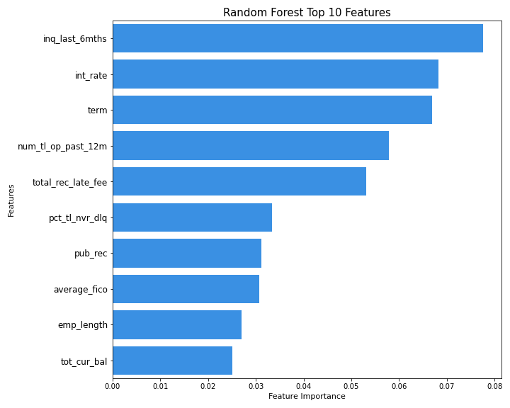

# Loan Loss Reduction

## Background

"LendingClub is an American peer-to-peer lending company, headquartered in San Francisco, California. It was the first peer-to-peer lender to register its offerings as securities with the Securities and Exchange Commission (SEC), and to offer loan trading on a secondary market. The company claims that $15.98 billion in loans had been originated through its platform up to December 31, 2015." (Wikipedia)

"LendingClub enables borrowers to create unsecured personal loans between \\$1000 - \\$40,000. The standard loan period is three years. Investors are able to search and browse the loan listings on LendingClub website and select loans that they want to invest in based on the information supplied about the borrower, amount of loan, loan grade, and loan purpose. Investors make money from the interest on these loans. LendingClub makes money by charging borrowers an origination fee and investors a service fee." (Wikipedia)

## Data

The data used in this analysis include Lending Club accepted loan data from 2007 - 2020Q3. The link to the dataset can be found on Kaggle where it was aggregated and uploaded. Below are some of the feature names and definitions provided in the dataset:

**Feature Names and Definitions as provided by Lending Club**

    -loan_amnt : The listed amount of the loan applied for by the borrower
    -term : The number of payments on the loan. Values are in months and can be either 36 or 60.
    -int_rate : Interest Rate on the loan
    -installment : The monthly payment owed by the borrower if the loan originates.
    -emp_length : Employment length in years
    -annual_inc : The self-reported annual income provided by the borrower during registration.
    -inq_last_6mths : The number of inquiries in past 6 months (excluding auto and mortgage inquiries)
    -pub_rec : Number of derogatory public records
    -revol_bal : Total credit revolving balance
    -total_acc : The total number of credit lines currently in the borrower's credit file
    -total_rec_late_fee : Late fees received to date
    -tot_cur_bal : Total current balance of all accounts
    -bc_util : Ratio of total current balance to high credit/credit limit for all bankcard accounts.
    -mo_sin_rcnt_tl : Months since most recent account opened
    -mths_since_recent_bc : Months since most recent bankcard account opened.
    -num_accts_ever_120_pd : Number of accounts ever 120 or more days past due
    -num_bc_sats : Number of satisfactory bankcard accounts
    -num_bc_tl : Number of bankcard accounts
    -num_op_rev_tl : Number of open revolving accounts
    -num_tl_90g_dpd_24m : Number of accounts 90 or more days past due in last 24 months
    -num_tl_op_past_12m : Number of accounts opened in past 12 months
    -pct_tl_nvr_dlq : Percent of trades never delinquent
    -total_bal_ex_mort : Total credit balance excluding mortgage
    -total_bc_limit : Total bankcard high credit/credit limit
    -total_il_high_credit_limit : Total installment high credit/credit limit
    -sub_grade : LC assigned loan subgrade
    -home_ownership : The home ownership status provided by the borrower during registration
    -verification_status : Indicates if income was verified by LC, not verified, or if the income source was verified
    -purpose : A category provided by the borrower for the loan request. 
    -application_type : Indicates whether the loan is an individual application or a joint application with two co-borrowers
    -dti : A ratio calculated using the borrower’s total monthly debt payments on the total debt obligations, divided by the borrower’s self-reported monthly income (debt-to-income)

As will be discussed in the remainder of this analysis, the above features were used and more to train our several classification models to predict whether or not an applicant will pay off their loan.

Below is also a link to the kaggle page where the dataset is posted.

    - https://www.kaggle.com/ethon0426/lending-club-20072020q1

## Business Problem

In order to consistently provide investor returns, Lending Club needs to appropriately vet their applicants to ensure that they indeed will pay off their loan in full with interest. To do so, Lending Club has asked us to analyze their prior loans over the period of 2007 - 2020 Q3 to provide them with insights on 1. What features are most important when assessing a potential applicants creditworthiness and 2. provide them with the best classification model that can accurately predict whether or not a potential applicant's loans will be charged off. Doing so, will allow Lending Club to make more sound decisions when offering lines of credit to future applicants.

## Methods

### Preprocessing

Given the dataset from Lending Club of previous loans from 2007 - 2020 Q3, our first step was to deal with missing values. Our original data had some 150+ features but there were 49 that were dropped due to having greater than 25% of their values as nan. Additionally, there were 15 features that were dropped due to multicollinearity concerns at our discretion as they were correlated to other features within our dataset above a threshold of .75. Once these were dealt with the next step was to handle the remaining features with missing values with less than 25% missing values. There were 5 features which had greater than 5% nan values and these values were randomly replaced with values with the respective weightings of the underlying features. For features with less than 5% missing values they were dropped which was around 100k rows

Lastly, we filtered our data by our target variable loan status Fully Paid and Charged Off as these instances are exactly of which we are trying to predict. This left us with an overall 1.73 million rows of loan related data.

### Feature Inspection and EDA

After the preliminary cleaning, there were 75 features remaining which were both categorical and continuous. Through inspecting our remaining features there were some numerical features that needed some manual attention to be cleaned such as interest rate and balance utilization which had percentages and needed to dealt with to convert them from objects to float/integers. Also, there were two features that were FICO range high and low which we took the average, created a new column, and dropped the original columns.

There were some categorical features were dropped due to having too many unique values and creating dummy variables for all unique values would have cause overfitting issues with our modeling. Additionally, there we had a feature for State of the loan recipient which we converted to regions as per the Census defined regions as 50 dummy variables was causing issues with our preliminary models as well.

To note, for each categorical feature I produced inspected their histograms and barplots with respect to loan status i.e. Fully Paid or Charged Off, to see how the differing groups were influenced by each status. Each continuous feature I investigated I plotted a histogram, boxplot, and the given feature by issue date to see trends in the underlying features separated by loan status groups as well.

#### Loan Amount

Loan Amount:
The listed amount of the loan applied for by the borrower. If at some point in time, the credit department reduces the loan amount, then it will be reflected in this value.

From our histogram we can see that loans are generally issued at increment of \\$5000. Our Boxplot shows us that loans that were charged off on average had higher loan amounts. This trend can also be seen in the final graph overtime. Also, our last graph shows us unsurprisingly that during covid loan amounts across both groups were reduced.

#### Grade and SubGrade

Grade: LC assigned loan grade

Sub_Grade: LC assigned loan subgrade

In the plots above, we note first that subgrade further distinguishes each grade into 1-5.
Across both features, as the grade letter decreases from A-G the rates at which loans are charged off increases so we expect that both of these features will have significant weights in our models

Additionally, most loans that were issued are in the A-C range of the grade/sub_grade spectrum

#### Average FICO score

As mentioned previously, the average FICO score takes the average of the upper and lower boundary of the borrower's FICO at loan origination.

For FICO scores we can see that the distribution is skewed toward borrowers with lower fico score, specifically below 725.
From the boxplot we can see that borrowers that fully paid off their loans had a higher average FICO score.
This trend holds true overtime as well, and was exacerbated even further when looking at average scores from 2020 and after.

#### Interest Rate

Interest Rate : Interest Rate on the loan

Preliminarily, we can see that interest rates issued are generally between 10-15%
Furthermore, the interest rates seem to be quite significant in whether a borrower paid off a loan, unsurprisingly I might add.
Overtime the difference in interest for borrower's who fully paid varied from 2-4%. The average interest rate on Fully Paid loans was 12.5% while for Charged Off loans was 15.6% which comes out to about a 20% increase in interest.

#### Term

Term : The number of payments on the loan. Values are in months and can be either 36 or 60.

Looking at loan term the options are 3 or 5 years. There were almost 3 times as many loans for 36 months than 5 years, and those that did have longer terms were twice as likely to be charged off 15% for 36 months and 30% 60 months

#### Debt-to-Income Ratio (DTI)

DTI: A ratio calculated using the borrower’s total monthly debt payments on the total debt obligations, excluding mortgage and the requested LC loan, divided by the borrower’s self-reported monthly income.

Most loans have a dti ratio between 12-22. There is a slightly higher Charged Off rate for higher DTI's with fully paid loans at 18% vs 20% for charged off loans

#### Annual Income

Annual Income: The self-reported annual income provided by the borrower during registration.

For Annual Income there was a extremely wide range so prior to plotting we removed values that were 3 standard deviations from the mean. That being said, the annual income for most loans was around the $70-80k level. As expected, borrowers that fully paid their loans had a higher average annual income by \\$7k

#### Home Ownership

Home Ownership: The home ownership status provided by the borrower during registration\xa0or obtained from the credit report.\xa0Our values are: RENT, OWN, MORTGAGE, OTHER

Most loans were given issued to borrowers who had a current mortgage followed by borrowers who were rental units. Borrowers who were in rental accomodations had the highest % of loans that were charged off follwed by borrower's who owned homes and had an existing mortgage respectively.

#### Total Received Late Fees

Total Received Late Fees: Number of late fees received to date

Roughly 80% of the loans issued did not have a late fee, but the average number of late fees for loans that were Fully Paid was .43 not even one late fee. On the other hand, for loans that were charged off average number of late fees was 2.8. The plot of late fees over time shows this best.

### Tranformation

After the prior steps of preprocessing, Feature Inspection and EDA, there were three main items that needed to be addressed with transformations. As we discovered in our Feature Inspection and EDA some of our features had extreme outliers. To address this issue prior to modelling we dropped outliers that were past 4 standard deviations. This also addresses the normality assumptions of our models.

Secondly, there was quite the class imbalance problem as our target Charged Off loans were only 20% of the overall population. To handle this, we used SMOTENC which synthetically oversamples the minority class to be to balance the weights of our data to 50/50. The smote adjusted data was only used to train our models while our testing was done on the scaled original data.

As the root of our predictions were binary classification i.e. will a borrower charge off their loan or not, we used min max scaling on both our training and testing data so as to arrange our data in a way that would perform best during the modeling.

## Results

In an attempt to find the best performing predictive model, we ran the following models on our data:

    - Logistic Regression
    - Decision Tree
    - XGBoosted Decision Tree
    - Random Forest
    - Neural Network

Each model taught us different features which should be of top focus when considering a potential borrower.

Overall our best performing model was a random forest with an accuracy score of .90 and a recall score of .58

### Logistic Regression

By looking at our feature coefficients of the logistic regression model we see that the top features are loan amount, interest rate, dti, total_rec_late_fee, and the deep sub grade categories. Our model performance was the worst performing of the group, but as a baseline it does highlight some highly influential features

### Decision Tree

Our Decision tree had a much better performance than our logistic regression model with an overall accuracy score of .85. It taught us that of the loans in our data the top feature was number of inquiries in the last 6 months. This hadn't quite been considered as a meaningful predictor least not by myself. Otherwise, interest rate, term, and total received late fees are also among the top 5 features.

Another shocking feature to note in the top 10 is number of accounts opened in the past 12 months is among the high scoring features. 

Below we can see our modeled decision tree for 3 splits deep. As shown in the above feature importance plot, the splits shown below are among the top feature importances

### XG Boosted Decision Tree

Our XG Boosted Decision tree ended up underperforming our 'plain' decision tree with an overall accuracy of .83, but even if not for performance the weights learned from running many weak learning trees is valuable. As such we can see new features among the top 10 are bankcard utilization and installment. Otherwise, it does reflect similarly to our other models with DTI as the **#1** feature followed by interest rate and other balances and limits.

### Random Forest

Our Random forest model surprisingly was our best performing model of the group with an overall accuracy score of .90.

Similar to our decision tree, our random forest's top feature was number inquiries in the past 6 months, followed by interest rate and term. Other notable, features that were not as influential in our other models are percent of accounts never delinquent and average FICO score, both which are quite intuitive.

### Neural Network

Our neural network model came up 4th among our 5 models in terms of accuracy, but worse overall for recall score. The network itself had 6 layers and included L2 regularization as well as dropout in the hidden layers.

## Conclusion

In conclusion, we would advise Lending Club to use a random forest model to predict loan losses of potential borrowers and perhaps. Criteria that Lending Club should be most aware in making the decision to extend a line of credit are the following:

 - Interest Rate
 - Debt to Income Ratio
 - Number of inquiries in the last 6 months
 - Term of the loan
 - Average FICO
 - What Sub Grade they would be classified in
 - Bankcard Utilization
 
A combination of predictive modeling and criteria awareness by Lending Club should allow them to reduce loan losses for prospective borrowers.

## Future Work

For future work, it would be relevant to analyze how this model performed throughout COVID as it is a prime example of an unexpected shock that would test any risk model. 

Additionally, to be able to create an even more complex neural network would likely increase our NN models score, but I digress. 

Other considerations would be including additional economic indicators or consumer sentiment/outlook numbers.

Investigate the potential pricing of the underlying loans to the extent that they are sold to investors on the secondary market.

Lastly, it would be interesting to have a model that considers active loans and probability of default for those loans in order to better prepare future windfall to Lending Club and its investors.
